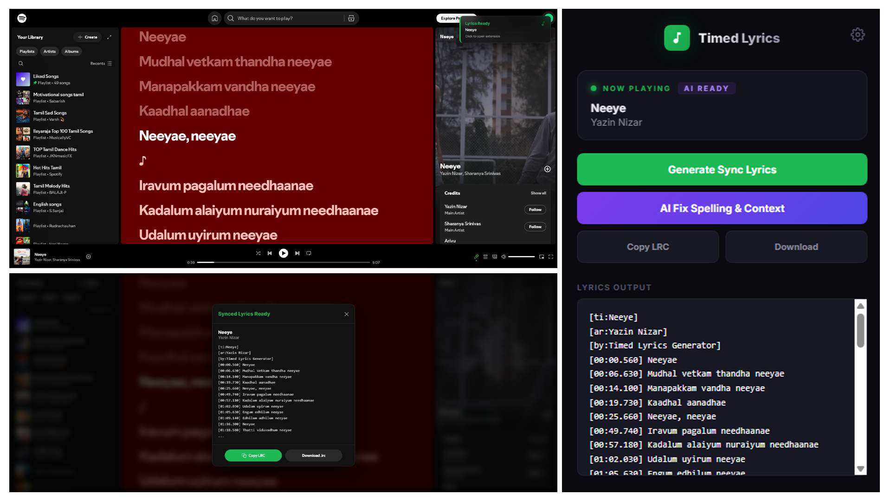

  

# 🎵 Timed Lyrics Generator (AI-Powered)
> **A sophisticated Chrome Extension that Bridges the gap between streamed music and synchronized lyric portability.**

---

## 🖥 Dashboard Preview

---

## 🔴 The Problem
Despite having access to millions of songs, music enthusiasts face three major frustrations:
1.  **Platform Lock-in:** Synced lyrics are trapped inside the Spotify app with no official way to export them for use in external players or video editing.
2.  **The "Broken Script" Issue:** For regional languages (like **Tamil** and **Tanglish**), auto-generated lyrics are often plagued by spelling errors, lack of proper word-joining (Sandhi), and inconsistent phonetic transcriptions.
3.  **Tedious Manual Syncing:** Creating `.lrc` files manually is a time-consuming process involving millisecond-perfect timing that most users avoid.

---

## 🟢 The Solution (Timed Lyrics Generator)
This extension provides a **Zero-Manual-Effort** workflow to generate high-fidelity, synchronized lyrics files:
*   **Packet Interception:** Instead of fragile DOM scraping, the extension intercepts raw network responses from Spotify's lyric provider, capturing millisecond-accurate timing data.
*   **Linguistic AI Agent:** Integrated with LLM models via OpenRouter to automatically fix complex Tamil Sandhi and Tanglish hyphenation in real-time.
*   **Instant Sync:** Converts raw JSON data into a standard `.lrc` format usable across all professional music environments.

---

## 🧠 Technical Challenges Overcome

### 1. Bypassing Isolated World Security
**Challenge:** Chrome Extensions normally cannot access the network activity of a host page directly. 
**Solution:** I implemented a **MAIN world injection** technique, patching the browser's native `fetch()` function. This "bridge" allows the extension to capture data packets before they are even processed by the Spotify web player's internal state.

### 2. The "Pre-fetch" Race Condition
**Challenge:** Spotify often fetches lyrics for the *next* 2-3 songs in the queue while the current song is still playing, causing traditional scrapers to save the wrong lyrics.
**Solution:** I built a **Stateful Multi-Track Buffer**. Every intercepted packet is mapped to a unique Spotify Track ID using URI parsing, ensuring the lyrics are correctly tied to the track metadata regardless of when they were fetched.

### 3. Context-Aware Linguistic Correction
**Challenge:** Regional languages like Tamil require more than just a "dictionary check"—they require understanding of word-joining (Sandhi).
**Solution:** Engineered a specialized **Linguistic Prompt** for OpenRouter LLMs. The engine distinguishes between Tamil script and Tanglish (Latin script), ensuring phonetic integrity is maintained while fixing structural readability.

---

## 🌟 Key Features
- **🎯 Zero-Click Capture**: Lyrics are captured the moment they load in the player.
- **✨ Glassmorphic UI**: A premium, blur-heavy interface consistent with modern OS aesthetics.
- **🔔 In-Page Notifications**: Sliding glass-morphic alerts notify you when a "Sync is Ready".
- **💾 Format Choice**: Export as refined `.lrc` or clean text.

---

## 🚀 Getting Started

1. **Clone & Load:** Load the project folder as an "Unpacked Extension" in Chrome.
2. **Setup AI:** Get your [OpenRouter API Key](https://openrouter.ai/) and paste it into the ⚙️ settings.
3. **Play & Sync:** Simply play a song. The extension will notify you when the sync is ready for export.

---

## 🧰 Tech Stack
- **Architecture:** Manifest V3, Webpack-less Vanilla JS logic.
- **Security:** MAIN World Proxying, Isolated World state management.
- **Design:** CSS glassmorphism, Backdrop Filters, Flexbox/Grid.
- **Intelligence:** OpenRouter API (Gemini/Llama/Mistral).

---

## 🤝 Support
If this technical implementation helped your workflow, please consider giving it a ⭐!
*(Built for educational purposes only. Not affiliated with Spotify.)*
